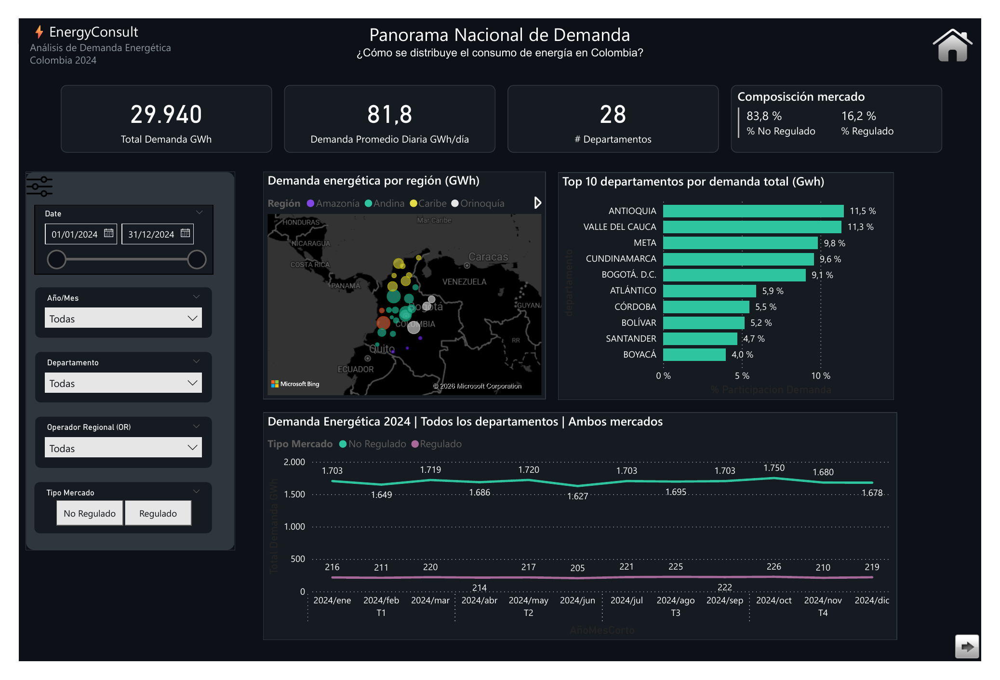
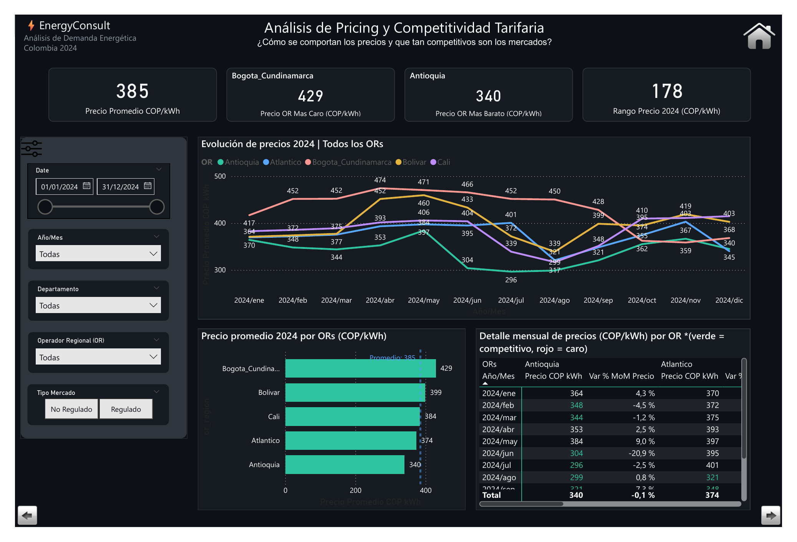
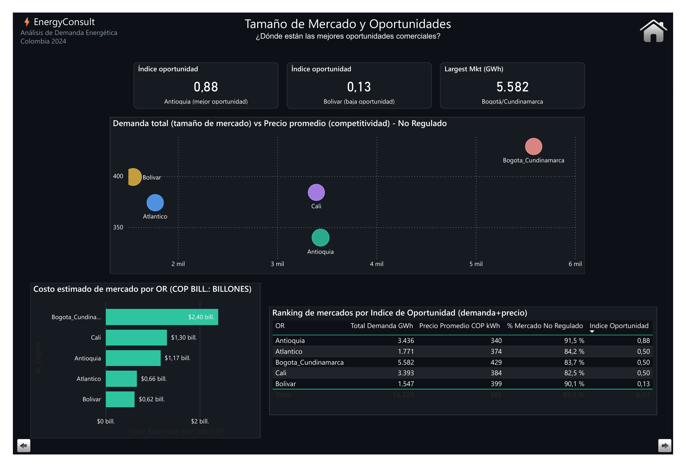
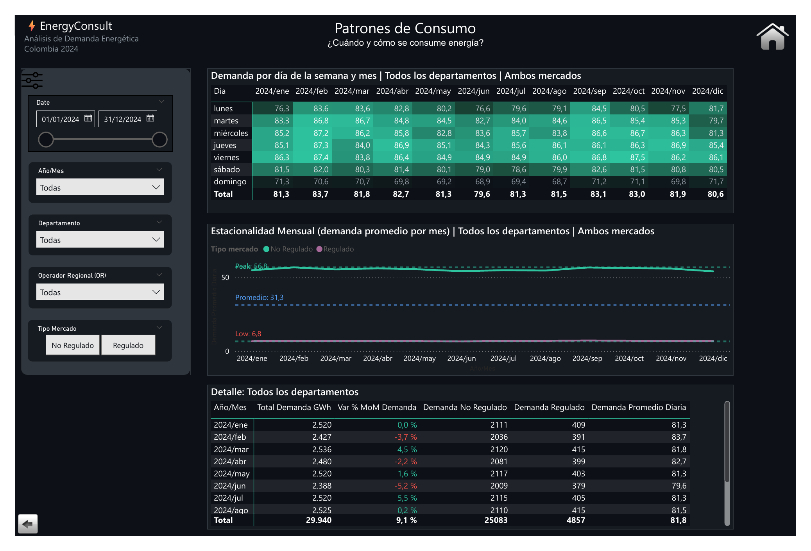

# EnergyConsult — Colombian Energy Demand Analysis 2024

> **Technical Challenge · Business Intelligence Analyst**
> Built by [Fredys Caballero](https://www.linkedin.com/in/fcaballerosoto/) · BI Analyst


---

## TL;DR

A commercial intelligence dashboard built for **EnergyConsult**, a Colombian energy consultancy working with the regional transmission organization (RTO). The challenge: analyze 2024 national energy demand patterns across 28 departments and identify commercial opportunities based on market size and tariff competitiveness.

**Result:** 4 Power BI reports · National demand overview · Pricing & competitiveness analysis · Market opportunity ranking with custom Opportunity Index · Consumption pattern analysis.

> *"Analyze consumption patterns and behaviors for 2024 and provide insights that can inform their commercial strategy."* — Challenge brief

---

## 📊 Dashboard Screenshots

### Report 1 — National Demand Overview
*How is energy consumption distributed across Colombia?*



### Report 2 — Pricing & Tariff Competitiveness
*How do prices behave and how competitive are the markets?*



### Report 3 — Market Size & Opportunities
*Where are the best commercial opportunities?*



### Report 4 — Consumption Patterns
*When and how is energy consumed?*



---

## Business Context

EnergyConsult operates as a consultant for Colombia's Regional Transmission Organization (RTO). The company needed visibility into national energy consumption to support its commercial expansion strategy — specifically, to identify which Regional Operators (ORs) and departments offer the best balance of market size and tariff competitiveness for new business development.

**The challenge:** Two raw datasets, no analytical infrastructure, and the need to go from data to strategic recommendations in a single deliverable.

---

## What I Built

### 4 Reports — One Strategic Narrative

```
Report 1 (National Overview)   →  Where is energy being consumed?
          ↓
Report 2 (Pricing)             →  How competitive are the tariffs by OR?
          ↓
Report 3 (Market Opportunities) →  Where should EnergyConsult focus commercially?
          ↓
Report 4 (Consumption Patterns) →  When and how does consumption behave?
```

All reports share synchronized filters for Date, Department, Regional Operator (OR), Market Type, and Year/Month — enabling drill-through analysis across all dimensions.

---

## 🔍 Key Findings

### National Demand
| KPI | Value |
|-----|-------|
| Total demand 2024 | **29,940 GWh** |
| Daily average | **81.8 GWh/day** |
| Departments analyzed | **28** |
| Non-regulated market share | **83.8%** |
| Regulated market share | **16.2%** |

**Top 5 departments by demand:**
Antioquia (11.5%) · Valle del Cauca (11.3%) · Meta (9.8%) · Cundinamarca (9.6%) · Bogotá D.C. (9.1%)

### Pricing & Competitiveness
| OR | Avg Price COP/kWh | Est. Market Value |
|----|-------------------|-------------------|
| Bogotá/Cundinamarca | 429 *(most expensive)* | $2.40 trillion COP |
| Bolívar | 399 | $0.62 trillion COP |
| Cali | 384 | $1.30 trillion COP |
| Atlántico | 374 | $0.66 trillion COP |
| Antioquia | 340 *(most competitive)* | $1.17 trillion COP |

**Price range across ORs:** 178 COP/kWh — significant variability creating arbitrage opportunities.

### Market Opportunity Index
A custom composite index was developed combining **demand volume** (market size) and **average tariff** (entry competitiveness) to rank each OR:

| OR | Demand (GWh) | Avg Price | Non-Reg % | Opportunity Index |
|----|-------------|-----------|-----------|-------------------|
| **Antioquia** | 3,436 | 340 | 91.5% | **0.88** ✅ Best |
| Atlántico | 1,771 | 374 | 84.2% | 0.50 |
| Bogotá/Cundinamarca | 5,582 | 429 | 83.7% | 0.50 |
| Cali | 3,393 | 384 | 82.5% | 0.50 |
| Bolívar | 1,547 | 399 | 90.1% | **0.13** ⚠️ Low |

**Strategic insight:** Antioquia offers the highest opportunity — large non-regulated market (91.5%) with the lowest average tariff (340 COP/kWh), indicating room for competitive pricing. Bogotá/Cundinamarca has the largest absolute market ($2.40T COP) but high tariffs reduce entry competitiveness.

### Consumption Patterns
- **Peak consumption:** Fridays consistently show the highest demand across all months
- **Lowest consumption:** Sundays (avg ~70 GWh/day vs 86 GWh on weekdays)
- **Seasonal low:** June shows the lowest monthly demand (-5.2% MoM) — likely linked to rainy season in key departments
- **Seasonal high:** March rebounds strongly (+4.5% MoM)
- **Non-regulated dominates:** The non-regulated market runs ~8x the volume of the regulated market daily

---

## Commercial Strategy Recommendations

Based on the analysis, three strategic priorities emerge for EnergyConsult:

**1. Prioritize Antioquia for immediate commercial expansion**
Highest opportunity index (0.88), lowest average tariff (340 COP/kWh), and 91.5% non-regulated market — ideal conditions for competitive energy offers.

**2. Approach Bogotá/Cundinamarca as a premium market**
Despite high tariffs (429 COP/kWh), this OR holds the largest estimated market value ($2.40T COP). A differentiated premium strategy targeting large non-regulated consumers could yield high-value contracts.

**3. Monitor seasonal demand for contract structuring**
June's consistent demand dip (-5.2% MoM) and Friday peak patterns suggest that variable-rate contracts aligned to weekly and seasonal cycles could create a competitive edge in pricing negotiations.

---

## 🛠️ Tech Stack

| Tool | Role |
|------|------|
| **Power BI Desktop** | Dashboard, data modeling, all visualizations |
| **Power Query (M)** | Data transformation, cleaning, calendar table, market type normalization |
| **DAX** | Custom measures: Opportunity Index, MoM variance, market composition %, demand averages |
| **Microsoft Excel** | Source data: demand by department + OR pricing data |
| **Bing Maps (Power BI)** | Geographic visualization of demand by region |

---

## 📁 Repository Structure

```
bia-energy-challenge/
├── dashboard/
│   └── EnergyConsult_DemandaEnergetica_CO_2024.pbix
├── datasets/
│   ├── Prueba_demanda_departamento.xlsx   ← Daily demand by department (GWh)
│   └── Prueba_Target_Market_Pricing_BI.xlsx ← OR pricing data (COP/kWh)
├── docs/
│   └── screenshots/
│       ├── 01_panorama_nacional.png
│       ├── 02_pricing_competitividad.png
│       ├── 03_tamano_mercado.png
│       └── 04_patrones_consumo.png
└── README.md
```

---

## 🚀 How to Use

**Prerequisites:** Power BI Desktop (any recent version)

1. Clone or download this repository
2. Open `dashboard/EnergyConsult_DemandaEnergetica_CO_2024.pbix`
3. If prompted to update data sources, point to the `datasets/` folder
4. All 4 report tabs load automatically with the included data

---

## Data Notes

- **Demand data:** Daily GWh consumption per department for 2024 — both regulated and non-regulated markets
- **Pricing data:** Monthly average tariffs per Regional Operator (OR) in COP/kWh
- **Opportunity Index:** Custom composite metric — normalized score combining demand volume (weight: market size signal) and inverse tariff (weight: entry competitiveness signal). Range: 0–1.
- **Market value estimate:** Calculated as Total Demand GWh × Average Price COP/kWh × 1,000 (unit conversion to COP billions)

---

## About

**Fredys Caballero** — Business Intelligence Analyst

4+ years building BI infrastructure, executive dashboards, and analytical models across high-growth tech companies and data-driven organizations. Specialized in Power BI, SQL, Python, and translating complex data into clear commercial decisions.

[](https://www.linkedin.com/in/fcaballerosoto/)
[](mailto:fredyscaballero@gmail.com)
[](https://github.com/fcaballerodata)

---

*Built as part of a technical assessment for Bia Energy · 2024*
*Dark mode dashboard designed for executive presentation*
